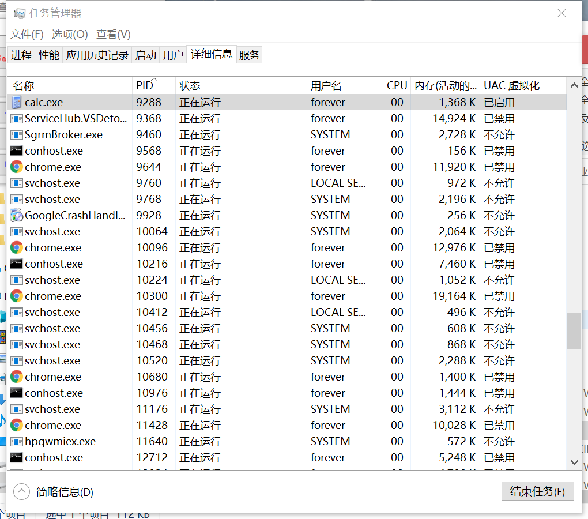
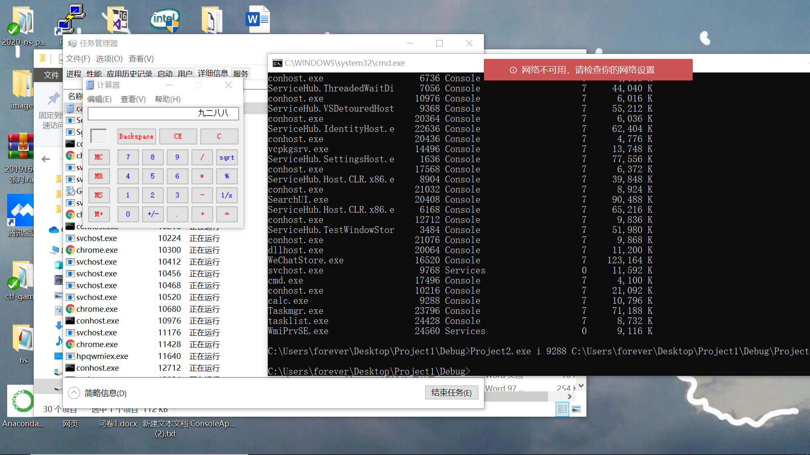

# 逆向大作业-通过Dll注入IATHook让计算器显示中文数字

## 实验目的：
- 通过注入Dll文件来钩取API，Dll文件注入目标进程后，修改IAT来更改进程中调用的特定的API的功能。

## 实验原理：
- IAT中保存着程序中调用函数API的地址，只要将IAT中的地址改成自己函数的地址，就可以实现IAT Hook。（根据查阅资料可知 计算器正常执行会调用SetWindowsTextW（））
- IAT即Import Address Table 是PE（可以理解为EXE）的输入地址表，我们知道一个程序运行时可以要调用多个模块，或都说要调用许多API函数，但这些函数不一定都在EXE本身中，例如你调用Messagebox来显示一个对话框时，Messagebox的函数的实现过程实际上是在user32.dll这个库文件中，当这个程序运行时会在user32.dll中找到Messagebox并调用它。

## 实现流程
> - 1.找到目标API
> - 2.编写DLL
> - 2.1 获得原目标API的地址并保存。
> - 2.2 实现自己的函数，并保存地址。
> - 2.3 找到IAT的地址，并找到API在其中的未知
> - 2.4 使用VirtualProtect将内存修改为可读写。
> - 2.5 修改IAT中的目标API的地址，替换为自己函数的地址
> - 2.6 恢复元内存属性。
> - 3.注入dll
> - 4.卸载dll

## 实验步骤：
- 首先在创建时候来保存原始IAT地址到全局变量，然后通过Hook_iat函数来进行iat函数的勾取
```
BOOL WINAPI DllMain(HINSTANCE hinstDLL, DWORD fdwReason, LPVOID lpvReserved)
{
	switch (fdwReason)
	{
	case DLL_PROCESS_ATTACH:
		// 保存原始API的地址  
		g_pOrginalFunction = GetProcAddress(GetModuleHandle(L"user32.dll"),
			"SetWindowTextW");

		// # hook  
		//   用hookiat.MySetWindowText钩取user32.SetWindowTextW  
		hook_iat("user32.dll", g_pOrginalFunction, (PROC)MySetWindowTextW);
		break;

	case DLL_PROCESS_DETACH:
		// # unhook  
		//   将calc.exe的IAT恢复原值  
		hook_iat("user32.dll", (PROC)MySetWindowTextW, g_pOrginalFunction);
		break;
	}

	return TRUE;
}
```
- 编写函数实现IATHook勾取(其中参数1为dll名称，参数2为原始的API地址（需要被勾取的），参数3为自己写的替换API地址的函数（勾取函数）)
```
BOOL hook_iat(LPCSTR szDllName, PROC pfnOrg, PROC pfnNew)
{
    HMODULE hMod;
    LPCSTR szLibName;
    PIMAGE_IMPORT_DESCRIPTOR pImportDesc; 
    PIMAGE_THUNK_DATA pThunk;
    DWORD dwOldProtect, dwRVA;
    PBYTE pAddr;
    
    // hMod, pAddr = ImageBase of calc.exe
    //             = VA to MZ signature (IMAGE_DOS_HEADER)
    hMod = GetModuleHandle(NULL);
    pAddr = (PBYTE)hMod;

    // pAddr = VA to PE signature (IMAGE_NT_HEADERS)
    pAddr += *((DWORD*)&pAddr[0x3C]);

    // dwRVA = RVA to IMAGE_IMPORT_DESCRIPTOR Table
    dwRVA = *((DWORD*)&pAddr[0x80]);

    
    pImportDesc = (PIMAGE_IMPORT_DESCRIPTOR)((DWORD)hMod+dwRVA);
    
    for( ; pImportDesc->Name; pImportDesc++ )
    {
        // szLibName = VA to IMAGE_IMPORT_DESCRIPTOR.Name
        szLibName = (LPCSTR)((DWORD)hMod + pImportDesc->Name);
        if( !_stricmp(szLibName, szDllName) )
        {
            // pThunk = IMAGE_IMPORT_DESCRIPTOR.FirstThunk
            //        = VA to IAT(Import Address Table)
            pThunk = (PIMAGE_THUNK_DATA)((DWORD)hMod + 
                                         pImportDesc->FirstThunk);

            // pThunk->u1.Function = VA to API
            for( ; pThunk->u1.Function; pThunk++ )
            {
                if( pThunk->u1.Function == (DWORD)pfnOrg )
                {
                    
                    VirtualProtect((LPVOID)&pThunk->u1.Function, 
                                   4, 
                                   PAGE_EXECUTE_READWRITE, 
                                   &dwOldProtect);

                    
                    pThunk->u1.Function = (DWORD)pfnNew;
                    
                    // 恢复内存属性
                    VirtualProtect((LPVOID)&pThunk->u1.Function, 
                                   4, 
                                   dwOldProtect, 
                                   &dwOldProtect);                        

                    return TRUE;
                }
            }
        }
    }

    return FALSE;
}
```
- 将阿拉伯数字转换为中文数字
```
BOOL WINAPI MySetWindowTextW(HWND hWnd, LPWSTR lpString)
{
    wchar_t* pNum = L"零一二三四五六七八九";
    wchar_t temp[2] = {0,};
    int i = 0, nLen = 0, nIndex = 0;

    nLen = wcslen(lpString);
    for(i = 0; i < nLen; i++)
    {
        // 将阿拉伯数字转换为中文数字
        //   lpString是宽字符的字符串
        if( L'0' <= lpString[i] && lpString[i] <= L'9' )
        {
            temp[0] = lpString[i];
            nIndex = _wtoi(temp);
            lpString[i] = pNum[nIndex];
        }
    }

    // 调用user32.setwindowsTextW()api
    //  修改lpstring缓冲区内的内容
    return ((PFSETWINDOWTEXTW)g_pOrgFunc)(hWnd, lpString);
}
```
- Dll注入
```
BOOL InjectDll(DWORD dwPID, LPCTSTR szDllName)
{
    HANDLE hProcess, hThread;
    LPVOID pRemoteBuf;
    DWORD dwBufSize = (DWORD)(_tcslen(szDllName) + 1) * sizeof(TCHAR);
    LPTHREAD_START_ROUTINE pThreadProc;
    
    if ( !(hProcess = OpenProcess(PROCESS_ALL_ACCESS, FALSE, dwPID)) )
    {
        DWORD dwErr = GetLastError();
        return FALSE;
    }
    
    pRemoteBuf = VirtualAllocEx(hProcess, NULL, dwBufSize, MEM_COMMIT, PAGE_READWRITE);

    
    WriteProcessMemory(hProcess, pRemoteBuf, (LPVOID)szDllName, dwBufSize, NULL);
     
    
    pThreadProc = (LPTHREAD_START_ROUTINE)GetProcAddress(GetModuleHandle(L"kernel32.dll"), "LoadLibraryW");

    
    hThread = CreateRemoteThread(hProcess, NULL, 0, pThreadProc, pRemoteBuf, 0, NULL);
    WaitForSingleObject(hThread, INFINITE);    

    CloseHandle(hThread);
    CloseHandle(hProcess);

    return TRUE;
} 
```
- Dll卸载
```
BOOL EjectDll(DWORD dwPID, LPCTSTR szDllName)
{
    BOOL bMore = FALSE, bFound = FALSE;
    HANDLE hSnapshot, hProcess, hThread;
    MODULEENTRY32 me = { sizeof(me) };
    LPTHREAD_START_ROUTINE pThreadProc;
    //dwPID =进程ID
    //使用TH32CS_SNAPMODULE参数，获取加载到进程的DLL名称
    if( INVALID_HANDLE_VALUE == (hSnapshot = CreateToolhelp32Snapshot(TH32CS_SNAPMODULE, dwPID)) )
        return FALSE;

    bMore = Module32First(hSnapshot, &me);
    for( ;bMore ;bMore = Module32Next(hSnapshot, &me) )
    {
        if( !_tcsicmp(me.szModule, szDllName) || !_tcsicmp(me.szExePath, szDllName) )
        {
            bFound = TRUE;
            break;
        }
    }

    if( !bFound )
    {
        CloseHandle(hSnapshot);
        return FALSE;
    }

    if( !(hProcess = OpenProcess(PROCESS_ALL_ACCESS, FALSE, dwPID)) )
    {
        CloseHandle(hSnapshot);
        return FALSE;
    }

    pThreadProc = (LPTHREAD_START_ROUTINE)GetProcAddress(GetModuleHandle(L"kernel32.dll"), "FreeLibrary");
    hThread = CreateRemoteThread(hProcess, NULL, 0, pThreadProc, me.modBaseAddr, 0, NULL);
    WaitForSingleObject(hThread, INFINITE);    

    CloseHandle(hThread);
    CloseHandle(hProcess);
    CloseHandle(hSnapshot);

    return TRUE;
}
```
- 利用命令行进行Dll注入和卸载
```
int _tmain(int argc, TCHAR* argv[])
{
	if (argc != 4)
	{
		usage();
		return 1;
	}

	// adjust privilege  
	_EnableNTPrivilege(SE_DEBUG_NAME, SE_PRIVILEGE_ENABLED);

	// InjectDll.exe <i|e> <PID> <dll_path>  
	if (!_tcsicmp(argv[1], L"i"))
	{
		InjectDll((DWORD)_tstoi(argv[2]), argv[3]);
	}
	else if (!_tcsicmp(argv[1], L"e"))
	{
		EjectDll((DWORD)_tstoi(argv[2]), argv[3]);
	}


	return 0;
}
```
- IATHook过程
> - 首先进行PE文件头信息的读取
> - 找到导入表对应的位置
> - 通过循环来比较找到user32.dll中的导入表结构
> - 由于计算器原有IAT内存区域是只可读的,所以勾取之前通过VirtualProtect函数将相应的IAT的内存区域更改为可读写模式
> - 修改IAT值（勾取）把原有指向user32.dll/Setwindowtext的值指向我们自己的函数MySetWindowTextW

- Dll注入过程
> - 使用dwPID获取目标进程句柄
> - 在目标进程内存中分配注入szdllName大小的内存
> - 将dll路径写入分配的内存
> - 获取loadLibraryW()API的地址
> - 在计算器进程中运行线程

## 实验结果




## 实验遇到的问题
- win10自带的计算器不能进行此实验，下载了一个xp的计算器得以实现
- 无法正确生成dll，查阅网上资料得到解决办法（参考资料）

## 参考资料
- [正确生成dll](https://www.cnblogs.com/lanhaicode/p/10798385.html)
- [实验参考1](https://blog.csdn.net/weixin_43742894/article/details/106021486)
- [实验参考2](https://www.cnblogs.com/hanhandaren/p/11499073.html)
- [PE](https://docs.microsoft.com/zh-cn/windows/win32/debug/pe-format)
- 老师视频教学
